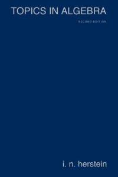
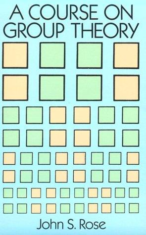
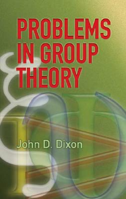

Math 3140: Abstract Algebra I -- Fall 2018
=========================================

**Instructor:** William DeMeo  
**Email:** [williamdemeo@gmail.com](mailto:williamdemeo@gmail.com)  
**Office:** MATH, Room 202  
**Office hours:** TBA
+ It is helpful (but not required) to send me an email in advance to let me know when you plan to visit.

**Lecture time/location:** MWF 9:00--9:50pm in MUEN D439.

**Course Webpage:** http://github.com/williamdemeo/math3140-fall2018 (this page!)

-------------------------------------------

You are now reading the main course webpage (which is simply a README.md
file in a GitHub repository called math3140-fall2018).  If you don't know what
the stuff in parentheses means, don't worry. It will be explained at our first
class meeting. 

The paragraphs below serve as the syllabus for Section B of Math 3140.

*This page and the subdirectories of this repository (see links above) will
 be updated throughout the semester, and students are expected to visit this
 page routinely.* 

Please bookmark this page or, better yet,
<a href="mailto:?subject=MATH 3140 webpage&amp;body=The Math 3140 webpage is
 http://github.com/williamdemeo/math3140-fall2018">email the url of this
 page to yourself!</a>

For this class the ISU Blackboard system will be used only for recording test scores. 

-----------------------------------------------------------------------
- [Prerequisites](#prerequisites)
- [Overview](#overview)
- [Learning Outcomes](#learning-outcomes)
- [Textbook](#textbook)
- [Homework](#homework)
- [Exams](#exams)
- [Computing](#computing)
- [Questions and Online Discussions](#questions-and-online-discussions)
- [Other references](#other-references)

Prerequisites
-------------
The most important prerequisite for this class is Math 2001.  If you did well in
Math 2001, you should be able to do well in this course.  Although you are not
expected to be highly skilled at constructing your own original proofs upon entering
this course, you should be familiar with basic methods of proof---such as induction, 
proof-by-contradiction---and what it means to prove a proposition or to prove 
the negation of a proposition; you should also know what words like "converse" and 
"contrapositive" mean.

During the first few lectures, we will review some of the required background.
If this early material seems unfamiliar and difficult to you, then it is likely
that you will find the course very challenging.

Overview
--------
Basic theory of groups and other algebraic structures, with an emphasis on writing proofs.  
+ Introduction to algebraic and relational structures.  
+ Brief introduction to a few special structures: groupoids, semigroups, monoids, graphs, posets, lattices.  
+ Elementary theory of groups: subgroups, cyclic groups, permutation groups, cosets.  
+ Isomorphisms, quotient groups, homomorphisms; group isomorphism theorems.  
+ Group actions, Sylow theorems.  
+ Introduction to rings (time permitting). 

Learning Outcomes
-----------------
Develop skill in communicating mathematics. Develop competence in writing proofs. 
Construct proofs about the following mathematical structures and concepts: groups,
lattices, homomorphisms, quotient groups, group actions, rings.

Textbook
--------
<a href="http://abstract.ups.edu/">  
[Abstract Algebra: theory and applications](http://abstract.ups.edu/)
by Tom Judson

See also the [other references](#other-references) below.

Homework
--------
**Homework is worth 30%** of the course grade and will be assigned slightly less than
once per week. Students must solve many homework problems in order to do well
in the course.

Homework is announced in lecture approximately once per week, and is
usually due the week after it is announced (with exact due dates specified
in lecture).

I will do my best to keep [our homework page](homework) updated with
a list of the problems that are due each week, but it is the students'
responsibility to show up for lecture to stay current with the course agenda.  

Although many homework problems will be assigned, only a limited number from
each assignment will be graded.  Therefore,
[solutions to many of the homework problems](homework/solutions) will
be made available, with the expectation that students will read the correct
solutions, compare them with their own, and understand the differences.
Students are not required to turn in corrected solutions, but
would do well to keep up with the corrections since these can be very 
useful when preparing for exams.

Exams
-----

**Two Midterm Exams each worth 20%** of the course grade will be given during the
  semester; the exact dates will be announced soon after the course begins.

+ Midterm Dates: TBA

The **Final Exam is worth 30%** of the course grade.
In accordance with university policy, the final exam must be taken by all
students at the scheduled time. *There are no make-up exams.*

+ Final Exam Date: **Wednesday, December 19, 1:30--4pm** in  MUEN D439.

Computing
---------

No prior programming experience is required for this course, and the amount of
computing done in this class will be left up to the students.  I encourage, but
do not require, all students to use the computer to help develop intuition about
the algebraic structures that we will study, and I will provide some guidance in
this regard.

**Sage:**
One of the best ways to develop a deeper understanding of many mathematical
subjects (abstract algebra in particular) is to use the computer to experiment
with and apply the theory.  For this purpose I recommend the open source math
software called [Sage](http://www.sagemath.org).  Sage essentially provides a
nice browser-based interface to a [vast array][] of well developed and powerful
open source mathematical software.

Getting started with Sage is very easy.  You don't even need to install any
software. By using Sage though a web browser you can and do all your computing,
and store all your Sage worksheets, in the cloud.

It's also possible to download and install Sage on your own computer.  Sage is free
and open source, and it is typically not *too* hard to install. 

Here are some things you might try to get started with Sage:

1. Go to http://www.sagemath.org/ and click [Try Sage Online](http://cloud.sagemath.com/).  
2. Check out the web page at
[http://abstract.ups.edu/sage-aata.html](http://abstract.ups.edu/sage-aata.html).
It is [a Sage companion to our textbook!](http://abstract.ups.edu/sage-aata.html)
3. Browse some of the [Sage Thematic Tutorials](http://www.sagemath.org/doc/thematic_tutorials/index.html)

If you've used Sage before and just need a quick refresher, you might
check out the [Sage Quick Start Guides](http://www.sagemath.org/doc/prep/quickstart.html).  

Questions and Online Discussions
--------------------------------
You are welcome to ask lots of questions in this class (during lecture, in
office hours, via email, etc.).  You are especially encouraged to use a public 
forum to ask questions so that all students can benefit.
The discussion forum that we will use for this class has yet to be determined, but will likely be Piazza.

Please consider posting to the
[class wiki pages](https://github.com/williamdemeo/math3140-fall2018/wiki)
when you want to ask a question, or raise an issue, or start an online dialog
with the prof and/or your classmates. If you have any trouble editing
the class wiki pages, please [notify the professor](mailto:williamdemeo@gmail.com).

Disabilities Statement
----------------------
If you believe that you have a disability that qualifies under the
Americans with Disabilities Act and Section 504 of the Rehabilitation
Act and requires accommodations, you should contact the [Student Disability
Resources Office](https://www.colorado.edu/disabilityservices/) for information on appropriate policies and procedures. 
The next step is to talk to the instructor who will be happy to assist with accommodations, but **will not
provide them retroactively** (so file the appropriate requests and paperwork 
before the first exam!)

Other References
----------------
[Our textbook](http://abstract.ups.edu/) should cover everything we need for
this course.  However, there are many other books that provide alternative
expositions of the same topics, and some are particularly good and might be
worth a look.  Here are a few of your instructor's favorites, along with some
comments about them:

<!-- Jacobson -->

**Jacobson**, *Basic Algebra I* -- covers roughly the same material as our textbook,
but at a higher level of sophistication; used, for example, as a textbook for
advanced undergraduates and beginning graduate students.

<!-- Herstein -->

**Herstein**, *Topics in Algebra* -- covers roughly the same material as our
textbook, but at a slightly higher level of sophistication; used, for example,
in an undergraduate honors abstract algebra course.

<!-- Rose -->

**Rose**, *A Course on Group Theory* -- We will spend a significant portion of our
time in this class studying *group theory*, and this book is an excellent
(and inexpensive) introduction to the subject. Our textbook provides a
sufficient treatment of group theory for our purposes, and Rose covers much more
than we will. However, you might find Rose's book useful if/when you are not
satisfied with our textbook's (or professor's) presentation of a particular topic. 

<!-- Dixon -->

**Dixon**, *Problems in Group Theory* -- our homework assignments should give you
plenty of practice solving problems in group theory; if you want more, I highly
recommend the book by Dixon. 

-----------------------

[vast array]: http://en.wikipedia.org/wiki/Sage_(mathematics_software)#Software_packages_contained_in_Sage
